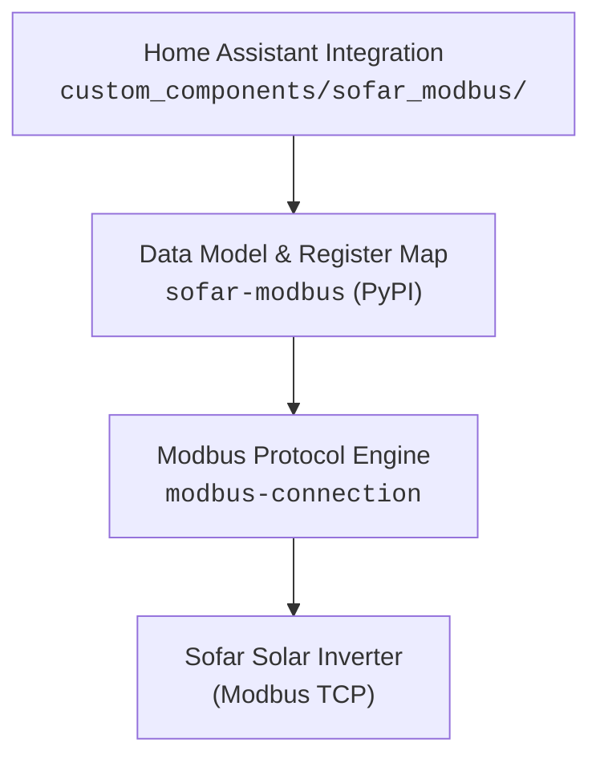

<p align="center">
  
</p>

<h1 align="center">Sofar Inverter Modbus for Home Assistant</h1>

<p align="center">
  <em>A high-performance, resilient Home Assistant integration for <b>Sofar Solar</b> inverters over Modbus TCP.</em>
</p>

<p align="center">
  <a href="https://github.com/hacs/default"></a>
  <a href="https://github.com/darkrain-nl/ha-sofar-modbus/actions/workflows/test.yml"></a>
  <a href="https://github.com/darkrain-nl/ha-sofar-modbus/releases/latest"></a>
  <a href="https://pypi.org/project/sofar-modbus/"></a>
  <a href="LICENSE"></a>
</p>

---

## ✨ Features

- ⚡ **Modern Async Core**: Built on [`modbus-connection`](https://github.com/home-assistant-libs/modbus-connection) with typed register planning, automatic reconnects, and zero custom socket hacks.
- 🛡️ **Fault-Tolerant Polling**:
  - **Single-Component Resilience**: A temporary slow or failed component block doesn't fail the rest of the poll.
  - **Tiered Scan Cadence**: Fast telemetry polling (~15s) with slow background polling (~60s) for static parameters.
  - **Retry-Before-Fail**: Immediate transient retry before marking a component failed.
  - **Transition-Only Logging**: Clear warning logged on initial failure transition; zero poll spam.
  - **Dead-Link Recovery**: Automatic transport disconnect and clean reconnect on wedged serial bridges.
- 📊 **Energy Dashboard Native**: Direct lifetime cumulative energy sensors (`TOTAL_INCREASING`) with `RestoreSensor` state restoration across Home Assistant restarts and high-water-mark dip protection.
- 🎛️ **Full Remote Control**:
  - **Remote Switch**: Grid-tie enable/disable.
  - **Active Power Control**: Export power limiting (% of rated power $P_n$).
  - **Feed-In Limitation**: Mode and power export caps (for systems with external meter/CT).
  - **Storage & Hybrid Control**: Charger use mode, EPS mode, and passive power charging/discharging.
- 🎨 **Native Brand Assets**: Bundles official SOFAR brand assets locally in `custom_components/sofar_modbus/brand/` for Home Assistant 2026.3+ Brands Proxy API.
- 🔍 **One-Click Diagnostics**: Download full raw register dumps for painless issue reporting.

---

## 📋 Compatibility

| Inverter Family | Example Models | Telemetry Sensors | Active Power / Feed-In Writes | Battery & Storage Writes |
|:---|:---|:---:|:---:|:---:|
| **PV-Only Grid-Tied** | 3.3KTLX-G3, 4.4KTLX-G3, 5K–12KTLX-G3 | ✅ Verified Live (88 entities) | ✅ Verified Live | ➖ *(N/A)* |
| **Hybrid Storage** | HYD 3K–6K-EP, HYD 5K–20KTL-3P, ME3000SP | ✅ Supported (173+ entities) | ✅ Supported | ✅ Supported (Mock Verified) |

> [!NOTE]
> Currently connects via **Modbus TCP** (direct network or Ethernet/Wi-Fi to RS485 bridge like USR-W610, Waveshare, or Elfin-EW11). Direct Serial (RTU) is on the roadmap.

---

## 🚀 Installation

### 1. Install via HACS
1. Open **HACS** → **Integrations** → click **⋮** (top right) → **Custom repositories**.
2. Add repository URL: `https://github.com/darkrain-nl/ha-sofar-modbus` with category **Integration**.
3. Search for **"Sofar Inverter Modbus"** and click **Download**.
4. **Restart Home Assistant**.

### 2. Configure Integration
1. Go to **Settings** → **Devices & Services** → **Add Integration**.
2. Search for **Sofar Inverter Modbus**.
3. Enter your inverter's **IP Address** and **Modbus TCP Port** (default `502`).

> [!WARNING]
> **Do not run alongside `homeassistant-solax-modbus` on the same Home Assistant instance.**  
> `solax_modbus` pins an incompatible legacy `tmodbus==0.4.1` in its manifest, whereas `modbus-connection` requires `tmodbus>=0.5.1`. Please remove or disable `solax_modbus` before loading this integration.

---

## 🔄 Migrating from `homeassistant-solax-modbus` & Energy Dashboard

If you are upgrading from `homeassistant-solax-modbus` and want to preserve all your historical solar generation data in Home Assistant's Energy Dashboard without any gaps or resets:

1. **Remove `solax_modbus`** from your Home Assistant instance.
2. **Install & configure `ha-sofar-modbus`** via HACS.
3. **Preserve your historical records (Match the Entity ID)**:
   Home Assistant stores long-term statistics (LTS) keyed by `entity_id`. `solax_modbus` typically created `sensor.sofar_solar_generation_total`, whereas Home Assistant's default naming for the new integration may assign `sensor.<area>_<device>_solar_generation_total` (e.g. `sensor.zolder_sofar_4_4_ktlx_g3_solar_generation_total`).
   - Go to **Settings → Entities**.
   - Search for **`Solar Generation Total`**.
   - Click the sensor → click the **Settings gear ⚙️**.
   - Change the **Entity ID** to match your existing Energy Dashboard entity ID (e.g. `sensor.sofar_solar_generation_total`).
   - **Do not remove or re-add the sensor in Energy Dashboard settings** — Home Assistant will seamlessly append all new readings to your existing historical charts.
4. **Recommended Energy Dashboard Configuration**:
   - **Solar production energy**: `Solar Generation Total` (`device_class: energy`, `state_class: total_increasing`).
   - **Solar production power**: `PV Power Total` (`pv_power_total`) or `Active Power Output Total` for the live real-time flow animation.

---

## 🎛️ Controls & Write Entities

<details>
<summary><b>Click to expand Write Entities & Staging UX details</b></summary>

### Staged Commit Pattern
For controls where the hardware expects multiple settings written together (like limitation mode + power cap):
1. Adjust the **Mode / Power Limit** select and number inputs.
2. Press the corresponding **Update Button** to commit both values together to the inverter.

> [!TIP]
> The Update button commits whatever values are currently displayed in the inputs at the moment you press it. Always adjust your inputs first, then press Update.

- **Remote Switch On/Off** (`select`): Immediate single-register control.
- **FeedIn Limitation Mode & Max Power** (`select` + `number` + `button`): Staged commit for export limiting against external PCC meter.
- **Active Power Control & Export Limit** (`switch` + `number` + `button`): Staged commit for direct inverter output throttle (% of rated power $P_n$).
- **Charger Use Mode** (`select`): Hybrid battery charging strategy.
- **EPS Mode** (`select`): Emergency Power Supply mode (requires EPS wiring).
- **Passive Mode Controls** (`number` + `select` + `button`): Direct battery charge/discharge and grid power setpoints for external energy managers.

</details>

---

## 🏗️ Architecture



1. **`modbus-connection`** — Connection management, block-read planning, binary decoding, reconnection, and typed exceptions (`modbus-connection[tmodbus]>=4.7.0,<5.0.0`).
2. **[`sofar-modbus`](https://github.com/darkrain-nl/sofar-modbus)** — PyPI dependency (`sofar-modbus>=0.1.5,<0.2.0`). HA-free device abstractions (`SofarInverter`/`SofarLegacyInverter`) and typed component register models.
3. **The integration** (`custom_components/sofar_modbus/`) — Owns the `ModbusConnection`, runs `SofarDataUpdateCoordinator`, exposes entities, bundles brand assets, and provides diagnostics.

### The register map is generated

The sensor description metadata in `custom_components/sofar_modbus/sensor.py` (below the `# GENERATOR: generated below` marker) is produced by [`scripts/generate_sofar_model.py`](scripts/generate_sofar_model.py), which extracts HA-facing metadata directly from the upstream plugin source.

```bash
uv run python scripts/extract_sofar_ast.py       # sanity-check counts against upstream
uv run python scripts/generate_sofar_model.py
```

---

## 💻 Development & Testing

This project uses [`uv`](https://github.com/astral-sh/uv) for fast, reproducible dependency management:

```bash
# Setup environment and install dependencies
uv sync --group test --group dev

# Run automated test suite
uv run python tests/lib/test_smoke.py          # Probe -> device -> entity filter
uv run python tests/lib/test_coordinator.py    # Resilience, retry & tiered cadence
uv run python tests/lib/test_diagnostics.py    # Diagnostics payload validation
uv run python tests/lib/test_write_entities.py # Staged write controls & mock backend

# Linting & Static Type Checking
uv run ruff check .
uv run mypy custom_components/sofar_modbus
```

---

## 🗺️ Roadmap

- [x] **Phase 0/1 — Core Sensors**: Read-only sensors on `modbus-connection`.
- [x] **Phase 2 — Write Controls**: `select`/`number`/`switch`/`button` for Remote Switch, Feed-In Limitation, and Active Power Control.
- [x] **Phase 3 — Resilience Engine**: Retry-before-fail, transition-only warning logging, tiered scan cadence, write-trigger refresh, diagnostics download.
- [x] **Phase 4 — Hybrid Controls**: Charger Use Mode, EPS Mode, and Passive Mode write entities.
- [x] **Phase 5 — Energy Dashboard**: Native `TOTAL_INCREASING` sensors with `RestoreSensor` state restoration.
- [x] **Brand Assets**: Bundled high-resolution light and dark icons and logos.
- [ ] **Serial RTU Transport**: Direct RS485 serial port support.
- [ ] **Core Modbus Hub Delegation**: Option to attach to HA's native Modbus hub.

---

## 📄 License & Attribution

- **Integration Code**: Released under the [Apache-2.0 License](LICENSE).
- **Register Map & Entity Metadata**: Derived from [`homeassistant-solax-modbus`](https://github.com/wills106/homeassistant-solax-modbus) (Apache-2.0).
- **Protocol Driver**: Powered by [`modbus-connection`](https://github.com/home-assistant-libs/modbus-connection).
